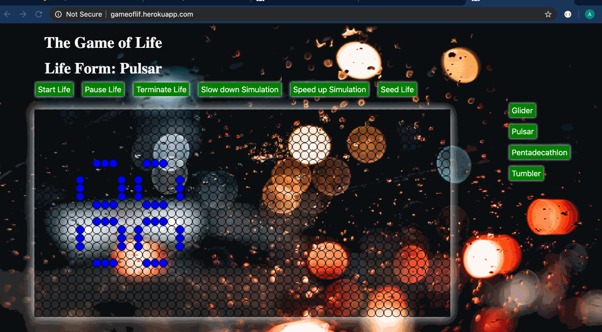

I did this project as a tribute to famous mathematician Mr John Conway who invented this game. The Game of Life is a game where one cell either lives or dies based on how many adjacent cells are alive. If you want to know more, click [here](https://en.wikipedia.org/wiki/Conway%27s_Game_of_Life). There are many patterns being discovered regularly. The project includes small library of some of them.     

checkout on: https://gameoflif.herokuapp.com/  (Note: I'm using Heroku and it might take 3-5 secs to load)
now also deployed at: https://adilnomad.github.io/gol/

